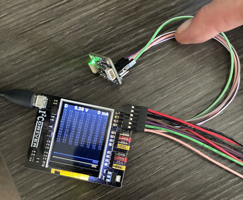
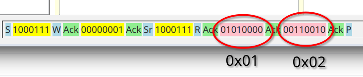

# Sending and Receiving low level I2C commands.

Preceeding text will walk through example of communicating with 
[BMP581](https://www.bosch-sensortec.com/en/products/environmental-sensors/pressure-sensors/bmp581), temperature 
and pressure sensor. Here is a picture _I2CDriver_ dongle and _BMP581_ breakout board connected together.

Now lets open _I2CC_ application. It should look like so:

In the lower right corner you can see that I2C dongle is connected on serial port `/dev/ttyUSB0`. If nothing is shown
that means that you do not have dongle connected or recognized by the host computer.

Clicking on _Scan_ button will perform scan for devices on I2C bus at which point they will appear in the dropdown box.

Application always operates within context of some project. Project **_default_** is, well, the default project. It is 
created the first time you run I2CC, and it cannot be deleted. Other user defined projects can be deleted at will.
Almost everything that you see on the screen is automatically saved in the open project, including window geometry,
registers were accessed, custom commands and so on. Thus, when you close and then open application again you should see 
almost exactly what you saw when you closed it. A new project can be created by going to 
menu "_File_" => "_New Project_".

Currently active project is shown in the left lower corner.

Clock speed by default is 100 KHz, but you can select higher value in `Speed` drop down box. Note that at higher speeds
you may need to lower value of the pullup resitor.

At the device address 0x47 I have
[BMP581](https://www.bosch-sensortec.com/en/products/environmental-sensors/pressure-sensors/bmp581)
temperature and pressure sensor. Register at address 0x1 holds ASCI ID which according the documentation should be
`0b01010000`. So, enter `1` into _Addr:_ field and click `Read Register` or simply press `Enter`. Note, that values in
_Addr:_ field are always interpreted as hexadecimal. You can also enter them with `0x` prefix to make it more explicit.

As a result at the bottom of the window you will see exact bits exchanged in the transaction between master and slave.

Highlighted in yellow are bits that were sent from master to the slave and in pink from slave to the master. Letters `S`
and `P` represent start and stop condition respectively.
`Sr` is a restart condition. `W` indicates that we are writing to the slave and
`R` that we are reading from the slave device. `Ack` is acknowledgment from either device. Unlikely `Nack` can also 
happen and it will appear in bright red. You can find more about details of how data is transferred on the wire in 
"[A Basic Guide to I2C](https://www.ti.com/lit/an/sbaa565/sbaa565.pdf)", pdf document maintained by Texas Instruments.

In the left most panel you will see results of reading that register. Both in hex and binary.

Indeed, you can see that value of this register is `0b01010000` as per the specification for this device.

Register at 0x1, however, is read/only, and so we cannot use it show write operation. Register 0x36 is read/write. 
It controls oversampling and selection if we want to measure pressure (temperature measurements are always enabled).
To set overampling rates to x1 for both pressure and temperature and enable pressure measurement we need to write 
`0b01000000` into this register. To that end we enter `0b01000000` into _Value:_ field and `0x36` into _Addr:_ and 
press `Write Register` button.

Note, that value has to be entered with prefixes ether `0x` or `0b` for hex or binary formats respectfully.

At the bottom you will see raw bit-by-bit transaction. 

The reason it is so long is that we combine it with read for the same register, which allows us to place register 
value into results panel.

Now that there are more than one register in the results panel it might make sense to be able to re-read all of them
by clicking on _Re-Read All_ button. Double-clicking on any row there will also re-read selected register.

Right mouse click will get you context menu.

Option "_Remove from results panel_" will remove selected row and "_Clear results panel_" will remove all rows.
We will come to see what "_Define register_" do in the next page of this tutorial.

## Multibyte registers

In BMP581 all registers hold one byte and their addresses fit into one byte. If you request to read two or more bytes
for a given register different things can happen depending on the make and model of the slave device. Sometimes it 
will simply return the same byte as many times as you have requested it. In case of BMP581 it will actually return 
value of the next registers. For example register `0x02` holds ASIC revision ID which will be `0b00110010`.
Let's request to read two bytes for register at address `0x01`.

At the bottom of application you will see following transaction log

You can see that first returned value is for register at address 0x01 and the second one for register at address 0x02.
I2CC, however, are anable to deduce that these bytes correspond to two different registers and since we requested to
read two byte register at address 0x01, then that is what it will assume. It is important to note that this behavior is
vendor specific. You will need to read documentation for your specific chip to understand it is to be expected here.

## Links

* [A Basic Guide to I2C](https://www.ti.com/lit/an/sbaa565/sbaa565.pdf) - I2C application note maintained by Texas Instruments.
* [BMP581](https://www.bosch-sensortec.com/en/products/environmental-sensors/pressure-sensors/bmp581) - sensor used in the example interaction above.