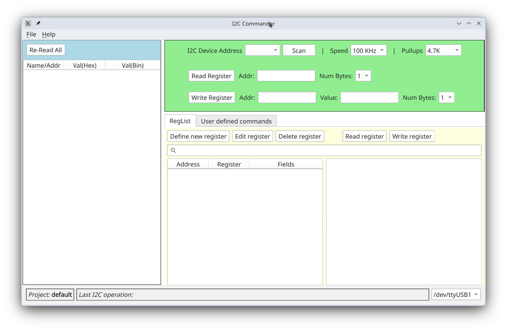
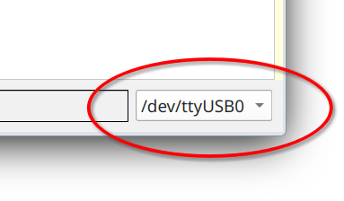
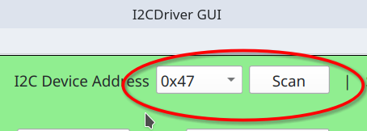
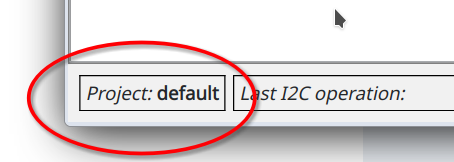
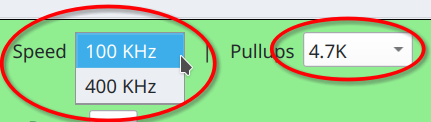
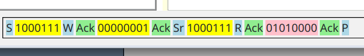
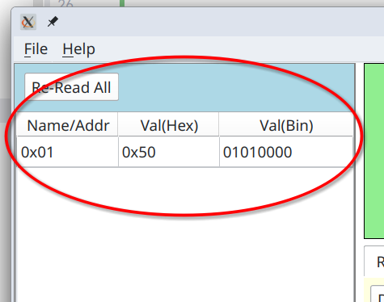
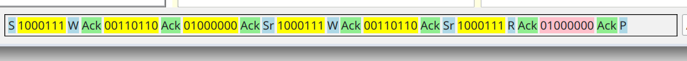
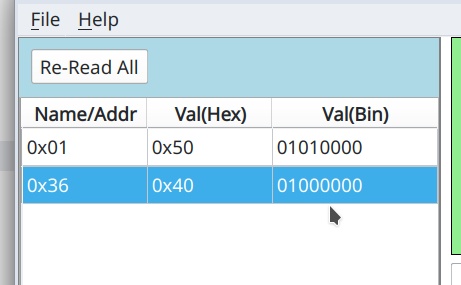
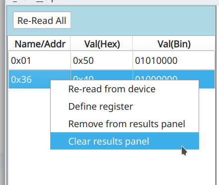

# Sending and Receiving low level I2C commands.

When you first open _I2CC_, it should look like so:

In the lower right corner you can see that I2C dongle is connected on serial port `/dev/ttyUSB0`. If nothing is shown
that means that you do not have dongle connected or recognized by the host computer.

Clicking on _Scan_ button will perform scan for devices on I2C bus at which point they will appear in the dropdown box.

Application always operates within context of some project. Project **_default_** is, well, the default project. That is
shown in the left lower corner. You can create new project by going to menu "_File_" => "_New Project_".

Clock speed by default is 100 KHz, but you can select higher value in `Speed` drop down box. Note that at higher speeds
you may need to lower value of the pullup resitor.

At the device address 0x47 I have
[BMP581](https://www.bosch-sensortec.com/en/products/environmental-sensors/pressure-sensors/bmp581)
temperature and pressure sensor. Register at address 0x1 holds ASCI ID which according the documentation should be
`0b01010000`. So, enter `1` into _Addr:_ field and click `Read Register` or simply press `Enter`. Note, that values in
_Addr:_ field are always interpreted as hexadecimal.

As a result at the bottom of the window you will exact bits exchanged in the transaction between master and slave.

Highlighted in yellow are bits that were sent from master to the slave and in pink from slave to the master. Letters `S`
and `P` represent start and stop condition respectively.
`Sr` is a restart condition. `W` indicates that we are writing to the slave and
`R` that we are reading from the slave device. `Ack` is acknowledgment from either device.

In the left most panel you will see results of reading that register. Both in hex and binary.

Indeed, you can see that value of this register is `0b01010000` as per the specification for this device.

Register at 0x1, however, is read/only, and so we cannot use it show write operation. Register 0x36 is read/write. 
It controls oversampling and selection if we want to measure pressure (temperature measurements are always enabled).
To set overampling rates to x1 for both pressure and temperature and enable pressure measurement we need to write 
`0b01000000` into this register. To that end we enter `0b01000000` into _Value:_ field and `0x36` into _Addr:_ and 
press `Write Register` button.

Note, that value has to be entered with prefixes ether `0x` or `0b` for hex or binary formats respectfully.

At the bottom you will see raw bit-by-bit transaction. 

The reason it is so long is that we combine it with read for the same register, which allows us to place register 
value into results panel.

Now that there are more than one register in the results panel it might make sense to be able to re-read all of them
by clicking on _Re-Read All_ button. Double-clicking on any row there will also re-read selected register.

Right mouse click will get you context menu.

## Links

* [BMP581](https://www.bosch-sensortec.com/en/products/environmental-sensors/pressure-sensors/bmp581) - sensor used in the example interaction above.