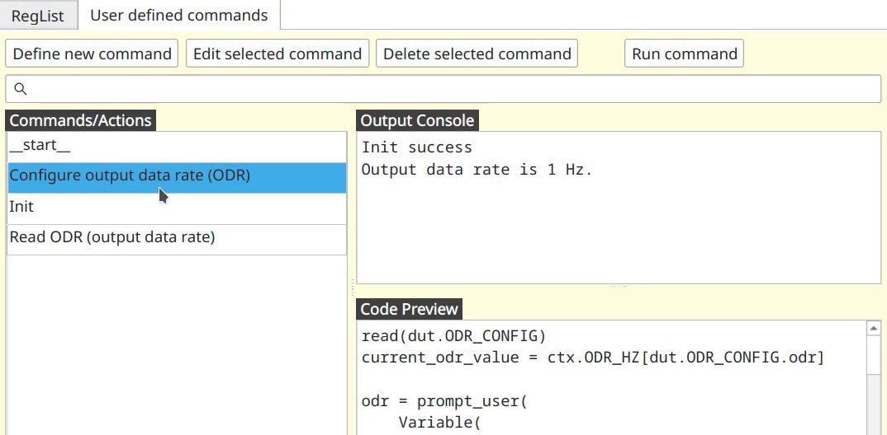
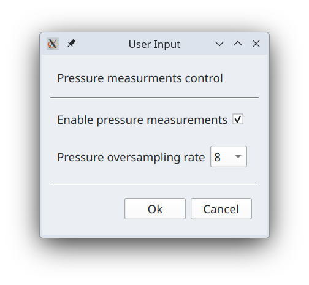
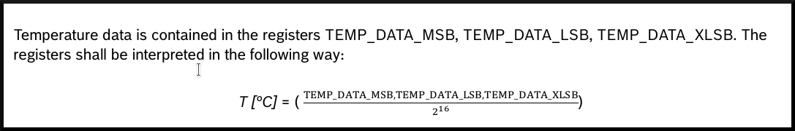

# Programing devices over I2C

Now that we know how to read and write individual registers we are ready to move up one level and use Python language
for programming devices directly inside _I2C Commander_. We use Python version 3.13 and inject into default environment
several variables, methods and classes useful for working with I2C devices. Below we will walk through several examples
to showcase how to write such programms/commands.

As before we are working with BMP581 chip. We assume that all registers from the datasheet have already being defined.

## BMP581 initialization

According to the datasheet after powering up the chip it is recommended to read several registers and confirm specific
values. If those values are as per specification, then proceed with temperature and pressure measurements.

* Read `CHIP_ID` register and check that its value is not 0.
* Confirm that in `STATUS` register fields `status_nvm_rdy` and `status_nvm_err` have values 1 and 0 respectively.
* Confirm that in register `INT_STATUS` field `por` is set to 1.

Note that reading `INIT_STATUS` register resets all of its fields to 0. This means that init sequence as outlined above
can only be run once on freshly powered on BPM581 chip.

Let's create function that performs these checks. First lets switch to the "_User defined commands_" tab.


You will see three main parts.

* _Commands/Actions_ - this is a list of custom commands defined by the user.
* _Output Console_ - printouts and error messages that would normally be written into a terminal will appear here.
* _Code Preview_ - here you will see the code as you click/select commands in the _Commands/Actions_ list.

Now click on "_Define new command_" button. New window will open where you can enter following


Line above, "Init" is a name of custom command as it will appear in the list of commands. And bellow is the code

```python
if ctx.init_done is not None:
    print("Power-on init sequence was already done once")
    exit()

read(dut.CHIP_ID)
read(dut.STATUS)
read(dut.INT_STATUS)

if dut.CHIP_ID.chip_id == 0:
    print("Init failed. CHIP_ID is 0")

elif dut.STATUS.status_nvm_rdy != 1:
    print(f"Init failed. STATUS.status_nvm_rdy is {dut.STATUS.status_nvm_rdy}")

elif dut.STATUS.status_nvm_err != 0:
    print(f"Init failed. STATUS.status_nvm_err is {dut.STATUS.status_nvm_err}")

elif dut.INT_STATUS.por != 1:
    print(f"Init failed. INT_STATUS.por is {dut.INT_STATUS.por}")

else:
    print("Init success")
    ctx.init_done = True
```

This code is plain python but implicitly in it several special functions and objects are available to the user. Let's go
over this code to see what they are.

First we are going to access variable `ctx.init_done` and see if it not `None`. Object `ctx` is global session
persistent context. You can read and place any variable in it, and it will survive from one invocation of the command to
the next. Context `ctx` is also shared between commands, which is how you can pass messages from one command to another.
When you access context variable that is not defined yet, it returns `None`. Variable becomes defined and populated by
some value when you assign some value to it. At the bottom you can see such assignment `ctx.init_done = True`. Thus, the
check at the top ensures that init sequence will not be run more than once.

Following three lines have form similar to `read(dut.CHIP_ID)`. Object `dut` is implicitly available to the user, and it
represents access to the _device under test_ (aka _DUT_) and its registers.

Function `read(...)` takes register as an argument and reads that register from the connected chip. After registers are
read we can access their fields. For example, we can check that `dut.CHIP_ID.chip_id == 0` and so on.

Now lets click "_Ok_" button. This command should now appear in the list.


Now if you double-click (or click on "_Run command_" button or simply press _Enter_ on the keyboard) on this action, its
code will execute and print `Init success` in _Output Console_. Subsequent calls to this command prints out
`Power-on init sequence was already done once`.

## Mapping ODR to human-readable values

Fixed point number numerical format is often not enough to express content of the registers in human-readable form. For
example `ODR_CONFIG` register has field called `odr`. It holds a value which maps to the actual output data rate in
Hertz using lookup table. For example value `0x0` maps to `240` Hz, `0x1` to `218.537` Hz and so on. Thus, we need to
create a list where value and index is a string that holds representation of output data rate in Hertz. We will place
this list into context `ctx` and initialize it in special command `__start__`.

Command named `__start__` is executed automatically when project is loaded including when _I2C Commander_ starts and
loads last opened project. Thus, this makes it an ideal place to initialize constants that can be used by other
commands. To that end, we create command named `__start__` with the following content.

```python
ctx.ODR_HZ = [
    "240", "218.537", "199.111", "179.2", "160",
    "149.333", "140", "129.855", "120", "110.164",
    "100.299", "89.6", "80", "70", "60", "50.056",
    "45.025", "40", "35", "30", "25.005", "20", "15",
    "10", "5", "4", "3", "2", "1", "0.5", "0.25", "0.125"
]
```

Index within this table corresponds to `ODR_CONFIG.odr` field value which we can simply use as index into this array.

Now let's create custom command named "_Read ODR (output data rate)_" with the following content.

```python
read(dut.ODR_CONFIG)

output_data_rate = ctx.ODR_HZ[dut.ODR_CONFIG.odr]
print(f"Output data rate is {output_data_rate} Hz.")
```

When this command is executed it should print something like this

```commandline
Output data rate is 1 Hz.
```

## Configuring ODR_CONFIG register

Now that we know how to read and display _output data rate_ values in human-readable format we will define graphical UI
for the `odr` field in `ODR_CONFIG` register. To that end we create custom command called

`Configure output data rate (ODR)`

with the following code

```python
read(dut.ODR_CONFIG)
current_odr_value = ctx.ODR_HZ[dut.ODR_CONFIG.odr]

odr = prompt_user(
    Variable(
        current_odr_value, valid_values=ctx.ODR_HZ, name="Output Data Rate [Hz]"
    )
)
new_odr_field_value = ctx.ODR_HZ.index(odr)

dut.ODR_CONFIG.odr = new_odr_field_value
write(dut.ODR_CONFIG)

read(dut.ODR_CONFIG)
current_odr_value = ctx.ODR_HZ[dut.ODR_CONFIG.odr]
print(f"Output data rate is configured to {current_odr_value} Hz")
```

When you run this command it should look like so:



Let us go over this code line by line to understand how it works. First, let's note that there are two new functions in
here, `prompt_user(...)` and `write(...)`. We will get to them shortly.

First we read `ODR_CONFIG` register and then obtain string human-readable representation of output data rate by
accessing `ctx.ODR_HZ` array at position of `ODR_CONFIG.odr` field value. We then call this:

```python
odr = prompt_user(
    Variable(
        current_odr_value, valid_values=ctx.ODR_HZ, name="Output Data Rate [Hz]"
    )
)
```

Function `prompt_user(...)` builds a GUI dialog window using drop down boxes, check boxes or string input fields and
presents it to the user. This GUI will always have `Ok` and `Cancel` buttons. If user clicks on `Cancel` or simply
closes this dialog, then at that point our command terminates. If, however, user clicks on `Ok` button, then this
function returns values selected by the user in that dialog window. This function takes one or more instances of class
`Variable`, which is a wrapper over simple variables that encapsulates data necessary for constructing user dialog. In
the example above it has `valid_values` set to an array of values `ctx.ODR_HZ`. This means that it will be shown as drop
down box with fixed choice selection. Initially it will be shown with value held in variable
`current_odr_value`. To the left of label "`Output Data Rate [Hz]`" will appear. Since `current_odr_value` is a string
returned value writen into `odr` variable will also be a string.

In a next few lines:

```python
new_odr_field_value = ctx.ODR_HZ.index(odr)
dut.ODR_CONFIG.odr = new_odr_field_value
write(dut.ODR_CONFIG)
```

First we find position of text in `odr` in `ctx.ODR_HZ` array and place it in `new_odr_field_value` variable. This
position is exactly the value that we write into `ODR_CONFIG.odr` field in the next line, and finally we write register
`dut.ODR_CONFIG` onto the device.

To confirm what was written we read back `dut.ODR_CONFIG` register again, obtain human-readable representation for
`odr` field and print it out.

```python
read(dut.ODR_CONFIG)
current_odr_value = ctx.ODR_HZ[dut.ODR_CONFIG.odr]
print(f"Output data rate is configured to {current_odr_value} Hz")
```

## Configuring pressure measurements

Now let's create a new command that has more than one GUI inputs. This will involve `OSR_CONFIG` register that holds
boolean field that enables or disables pressure measurements and another field that defines oversampling rate for
pressure measurements. Similarly, to output data rate above we need to create a lookup table/array in `__start__`
command.

```python
ctx.OSR = [1, 2, 4, 8, 16, 32, 64]
```

Then let's create a command named

`Pressure measurments control`

with the following code:

```python
read(dut.OSR_CONFIG)

pressure_enable, p_oversampling_rate = prompt_user(
    Variable(
        bool(dut.OSR_CONFIG.press_en), name="Enable pressure measurements"
    ),
    Variable(
        ctx.OSR[dut.OSR_CONFIG.osr_p],
        valid_values=ctx.OSR,
        name="Pressure oversampling rate"
    )
)

dut.OSR_CONFIG.press_en = bool(pressure_enable)
dut.OSR_CONFIG.osr_p = ctx.OSR.index(p_oversampling_rate)
write(dut.OSR_CONFIG)

# read back register and printout actrually set values
read(dut.OSR_CONFIG)
if bool(dut.OSR_CONFIG.press_en):
    print("Pressure measurements enabled")
else:
    print("Pressure measurements disabled")

print(f"Pressure oversampling rate =", ctx.OSR[dut.OSR_CONFIG.osr_p])
```

First variable is a boolean and thus will be presented to the user as checkbox. Like so



## Reading temperature

In BPM581 chip measured temperature and pressure values occupy 24 bits and thus stored in three bytes each. Thus, to
read these values we need to read all three registers, combine them into one and re-interpret their values. Here we will
create a command for triggering single shot temperature measurement, reading measured value and presenting it to the
user. Let's call it

`One-shot temperature read`

and code:

```python
import time

read(dut.ODR_CONFIG)
dut.ODR_CONFIG.pwr_mode = 2  # forced one time measurement
write(dut.ODR_CONFIG)

time.sleep(0.005)  # 5 ms. delay for measurement to complete

read(dut.TEMP_DATA_XLSB)
read(dut.TEMP_DATA_LSB)
read(dut.TEMP_DATA_MSB)

temp_C = S(16, [
    dut.TEMP_DATA_MSB.temp_23_16_raw,
    dut.TEMP_DATA_LSB.temp_15_8_raw,
    dut.TEMP_DATA_XLSB.temp_7_0_raw
])

print(f"Temperature {temp_C} C")
```

According to the datasheet temperature is obtained using this formula:



In other words we need to take three bitarrays from `TEMP_DATA_XLSB.temp_7_0`, `TEMP_DATA_LSB.temp_15_8` and
`TEMP_DATA_MSB.temp_23_16` fields, combine them into one bitarray and interpret it as `U24.16` fixed point number.
However, according to the definition for these registers fields are always interpreted as some numeric value, not raw
bitarrays. To access field values as raw bitarrays you can append `_raw` suffix, which is what you see in this code

```python
temp_C = S(16, [dut.TEMP_DATA_MSB.temp_23_16_raw, dut.TEMP_DATA_LSB.temp_15_8_raw, dut.TEMP_DATA_XLSB.temp_7_0_raw])
```

Function `S(...)` interprets supplied bitarrays as a signed number. It takes two arguments. First argument is value of
the fractional part in the fixed point number definition (in case above that is 16 as in `U24.16`) and second, array of
bitarrays. Companion function `U(...)` is similar, but interprets combined bitarrays as unsigned number. Both functions
`U(...)` and `S(...)` return floating point number after interpretation.
