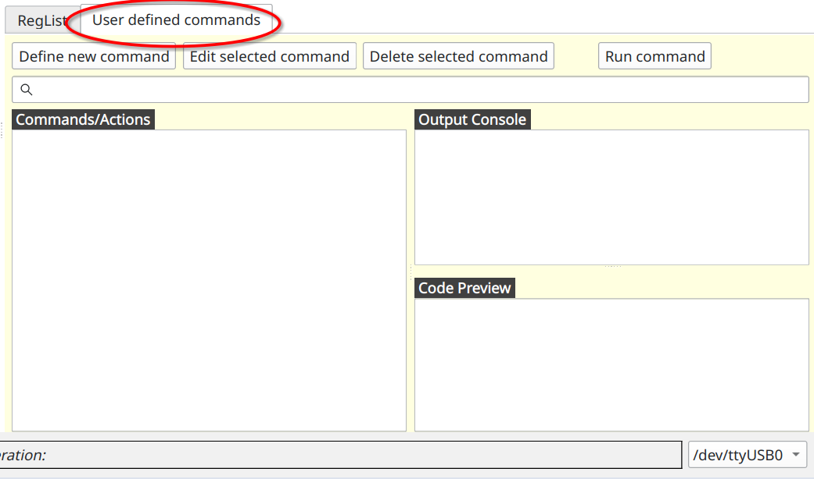
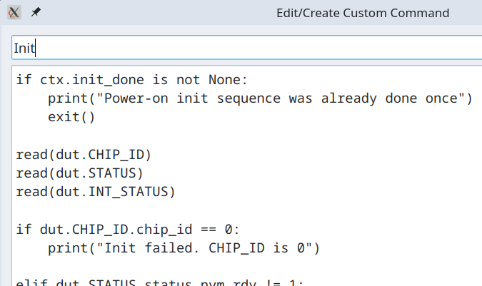
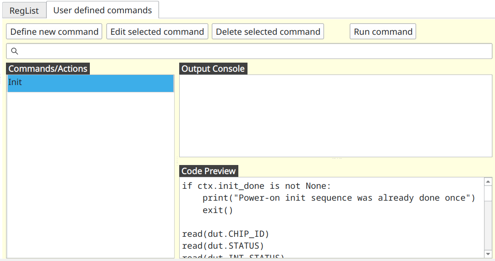

# Programing devices over I2C

Now that we know how to read and write individual registers we are ready to move up one level and use Python language
for programming devices directly inside _I2C Commander_.

As before we are working with BMP581 chip. We assume that all registers from the datasheet have already being defined.

## BMP581 initialization

According to the datasheet after powering up the chip it is recommended to read several registers and confirm specific
values. If those values are as per specification, then proceed with temperature and pressure measurements.

* Read `CHIP_ID` register and check that its value is not 0.
* Confirm that in `STATUS` register fields `status_nvm_rdy` and `status_nvm_err` have values 1 and 0 respectively.
* Confirm that in register `INT_STATUS` field `por` is set to 1.

Note that reading `INIT_STATUS` register resets all of its fields to 0. This means that init sequence as outlined above
can only be run once on freshly powered on BPM581 chip.

Let's create function that performs these checks. First lets switch to the "_User defined commands_" tab.



You will see three main parts.

* _Commands/Actions_ - this is a list of custom commands defined by the user.
* _Output Console_ - printouts and error messages that would normally be written into a terminal will appear here.
* _Code Preview_ - here you will see the code as you click/select commands in the _Commands/Actions_ list.

Now click on "_Define new command_" button. New window will open where you can enter following



Line above, "Init" is a name of custom command as it will appear in the list of commands. And bellow is the code

```python
if ctx.init_done is not None:
    print("Power-on init sequence was already done once")
    exit()

read(dut.CHIP_ID)
read(dut.STATUS)
read(dut.INT_STATUS)

if dut.CHIP_ID.chip_id == 0:
    print("Init failed. CHIP_ID is 0")

elif dut.STATUS.status_nvm_rdy != 1:
    print(f"Init failed. STATUS.status_nvm_rdy is {dut.STATUS.status_nvm_rdy}")

elif dut.STATUS.status_nvm_err != 0:
    print(f"Init failed. STATUS.status_nvm_err is {dut.STATUS.status_nvm_err}")

elif dut.INT_STATUS.por != 1:
    print(f"Init failed. INT_STATUS.por is {dut.INT_STATUS.por}")

else:
    print("Init success")
    ctx.init_done = True
```

This code is plain python but implicitly in it several special functions and objects are available to the user. Let's go
over this code to see what they are.

First we are going to access variable `ctx.init_done` and see if it not `None`. Object `ctx` is global session
persistent context. You can read and place any variable in it, and it will survive from one invocation of the command to
the next. Context `ctx` is also shared between commands, which is how you can pass messages from one command to another.
When you access context variable that is not defined yet, it returns `None`. Variable becomes defined and populated by
some value when you assign some value to it. At the bottom you can see such assignment `ctx.init_done = True`. Thus, the
check at the top ensures that init sequence will not be run more than once.

Following three lines have form similar to `read(dut.CHIP_ID)`. Object `dut` is implicitly available to the user, and it
represents access to the _device under test_ (aka _DUT_) and its registers.

Function `read(...)` takes register as an argument and reads that register from the connected chip. After registers are
read we can access their fields. For example, we can check that `dut.CHIP_ID.chip_id == 0` and so on.

Now lets click "_Ok_" button. This command should now appear in the list.



Now if you double-click (or click on "_Run command_" button or simply press _Enter_ on the keyboard) on this action, its
code will execute and print `Init success` in _Output Console_. Subsequent calls to this command prints out
`Power-on init sequence was already done once`.

## Mapping ODR to human-readable values

Fixed point number numerical format is often not enough to express content of the registers in human-readable form. For
example `ODR_CONFIG` register has field called `odr`. It holds a value which maps to the actual output data rate in
Hertz using lookup table. For example value `0x0` maps to `240` Hz, `0x1` to `218.537` Hz and so on. Thus, we need to
create a list where value and index is a string that holds representation of output data rate in Hertz. We wiil place
this list into context `ctx` and initialize it in special command `__start__`.

Command named `__start__` is executed automatically when project is loaded including when _I2C Commander_ starts and
loads last opened project. Thus, this makes it an ideal place to initialize constants that can be used by other
commands. To that end, we create command named `__start__` with following content.

```python
ctx.ODR_HZ = [
    "240", "218.537", "199.111", "179.2", "160",
    "149.333", "140", "129.855", "120", "110.164",
    "100.299", "89.6", "80", "70", "60", "50.056",
    "45.025", "40", "35", "30", "25.005", "20", "15",
    "10", "5", "4", "3", "2", "1", "0.5", "0.25", "0.125"
]
```

Now let's create custom command named "_Read ODR (output data rate)_" with following content.

```python
read(dut.ODR_CONFIG)

output_data_rate = ctx.ODR_HZ[dut.ODR_CONFIG.odr]
print(f"Output data rate is {output_data_rate} Hz.")
```

When this command is executed it should print something like this

```commandline
Output data rate is 1 Hz.
```

## Configuring ODR_CONFIG register

Now that we know how to read and display _output data rate_ values we define graphical UI for changing these values.

## Special I2CC Python methods and variables

* `read(...)` - reads register from the target slave device.
* `dut` - "device under test" variable used to access registers.
* `ctx` - global context object that lives within a session of `I2C Commander`
* ...

