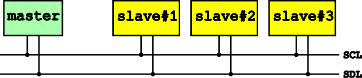
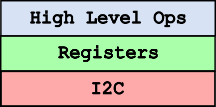

# I2C Commander (I2CC)

Consider a case where you need to interface with some embedded relatively low level device. For example an environmental
sensor, an accelerometer, pwm generator that controls LEDs or something else. More often than not you will be interacting with
such device using [I2C](https://en.wikipedia.org/wiki/I2C) protocol. This is a very low level two-wire protocol that can
connect multiple devices on the same bus.

Two wires that define I2C bus are _serial clock line_ (SCL) and _serial data line_ (SDL). Any given device connected on
the bus is either a _master_ or a _slave_. Master is the only device that initiates communication to a slave, and it is
the one that drives the clock line. Note that while in general multiple masters on the same bus are possible not every
master supports logic for negotiating between masters. Slave devices are passive. They watch clock and data lines and
respond when requested by the master. I2C protocol defines only slave devices addressing and commands when master writes
something to a slave or reads from one. Based on this low level communication protocol devices define next higher level
abstraction. Typically, abstraction of registers with their addresses and values and commands on I2C bus to read and
write such registers. Above that, in the vendor specifications datasheets you find next level of abstraction related to
even higher level concepts such as internal state of the device, how to control data acquisition, perform calibration and
so on.

I2C Commander is a GUI application that allows you to address all three levels if abstraction when interfacing with I2C
devices. To that end it controls generic I2C master device that can send and receive arbitrary commands on the bus. At
the moment it uses [I²CDriver](https://i2cdriver.com/) dongle that on one end connects to the host computer over USB and
on the other end has pins to connect it to the I2C bus.

## Links

* [I2C](https://en.wikipedia.org/wiki/I2C) - Wikipedia page about I2C protocol.
* [I²CDriver](https://i2cdriver.com/) - USB to I2C dongle used by _i2cc_.