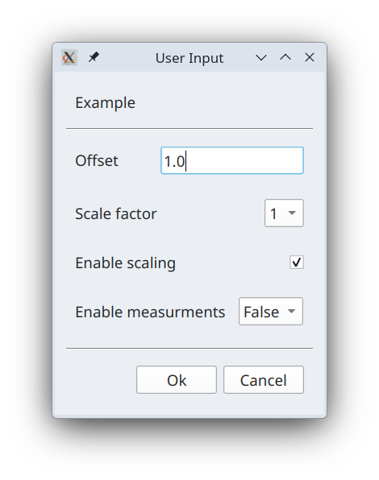

# Programming language reference

Language used in the code for custom commands is Python 3.13. Below we describe in 
details additional variables, functions and objects available to developer of the 
custom commands that aid access to the I2C devices and their registers.

## Variables

### **\_\_project_name\_\_**
Variable that holds name of the current project. 

### **\_\_command_name\_\_**
Variable that holds name of the command that is executing.

### **\_\_device_address\_\_** 
Integer variable that holds i2c device address as selected in the GUI.

## Objects

### **ctx**

Context object that persists across the project session. Project session refers to a 
time duration when a given project is active. That is for example from the moment
application starts and previously loaded project is loaded again until either application
closes or user opens another project. Context object can be used to store arbitrary 
variables and functions which become available to all defined custom commands. Assigning
arbitrary variable in the context `ctx` creates it and attempts to access variable before it is being 
assigned return `None`.

```python
ctx.OSR = [1, 2, 4, 8, 16, 32, 64]
```

### **dut**

_Device Under Test_ (aka DUT) object that use to access register and theirs field as defined in
the _RegList_. For example

```python
dut.OSR_CONFIG # the whole register
dut.OSR_CONFIG.osr_p # field osr_p in the OSR_CONFIG register
```

Normal register fields are always interpreted as number according the fixed point number 
definition in the register model in RegList. To access raw BitArray for a given field
append `_raw` prefix.

```python
dut.OSR_CONFIG.osr_p_raw # returns raw BitArray object for a field osr_p
```

## Functions & Classes

### **read(...)**

This function takes register as an argument, reads register value from the connected device
and updates register with read value. The reason we want to do that is because any register 
in the `dut` object are in memory objects that hold last read or a default value. Calling this 
function allows us to update register object in memory with register value as it is present
in the I2C device. This function returns None.

```python
read(dut.OSR_CONFIG)
```


### **write(...)**

This function take register as an argument and writes its in-memory content into the 
corresponding register on connected I2C device. This function returns None.

```python
write(dut.OSR_CONFIG)
```

### **Variable**

Class `Variable` is a wrapper over any regular python variable that adds various metadata
that is used to build GUI dialog when method `prompt_user(...)` is called. Its first 
agument is value that is to be wrapped inside of this class. Other two arguments
are optional 

* `valid_values` - array of possible values which can be assigned to the value contained 
    inside. If not given, then any value can later be assigned to variable inside.
* `name` - user-friendly name associated with this variable.

```python
Variable(1, valid_values=[1, 2, 4, 8, 16], name="Sampling rate")
```

### **prompt_user(...)**

Given its arguments, which are one or more instances of `Variable` (see above) constructs
and presents GUI input dialog to the user. If user clicks `Ok` button in the dialog, then it
returns n-tuple of values selected by the user in the order in which `Variable` objects 
were passed to this function.

```python
a, b, c, d = prompt_user(
    Variable(1.0, name="Offset"),
    Variable(1, valid_values=[1, 2, 4, 8], name="Scale factor"),
    Variable(True, name="Enable scaling"),
    Variable(False, valid_values=[True, False], name="Enable measurments")
)
```

Example above build GUI dialog that looks like so



These GUI controls are formed according to the following logic.

```shell
if wrapped variable is boolean
    if valid_array is given
       show drop down box with `True` and `False` choices
    else
        show checkbox
        
else if valid_values is given
    show drop down box with choices from value_values agument

else if wrapped variable is integer
    show text input field and validate and constrain its content to be integer 

else if wrapped variable is float
    show text input field and validate and constrain its content to be float 
    
else
    show text input field with no validation and no contrains on its content 
```

## **U(n, [BitArray])**

This function converts list of BitArray objects as one large BitArray into floating point 
number according fixed point interpretation `U{w}.{n}` where `{w}` width of sum of all 
BitArray objects and `{n}` is $1/2^n$ scaling factor.

```python
temp_C = S(16, [
    dut.TEMP_DATA_MSB.temp_23_16_raw, 
    dut.TEMP_DATA_LSB.temp_15_8_raw, 
    dut.TEMP_DATA_XLSB.temp_7_0_raw
])
```

## **S(n, [BitArray])**

Same as function `U(...)` but it interprets combined BitArray as signed number.