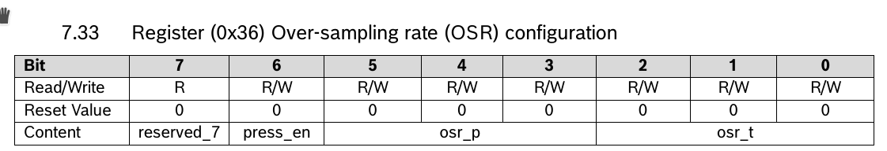
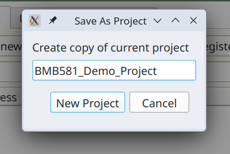
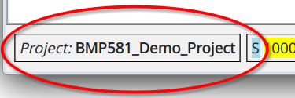
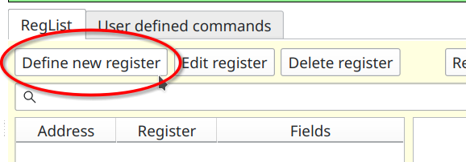
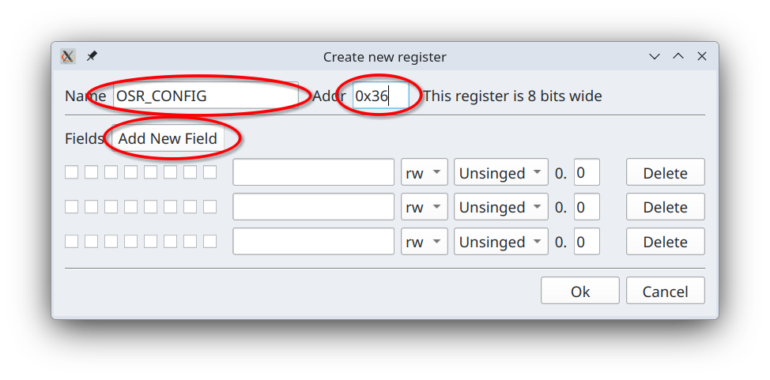
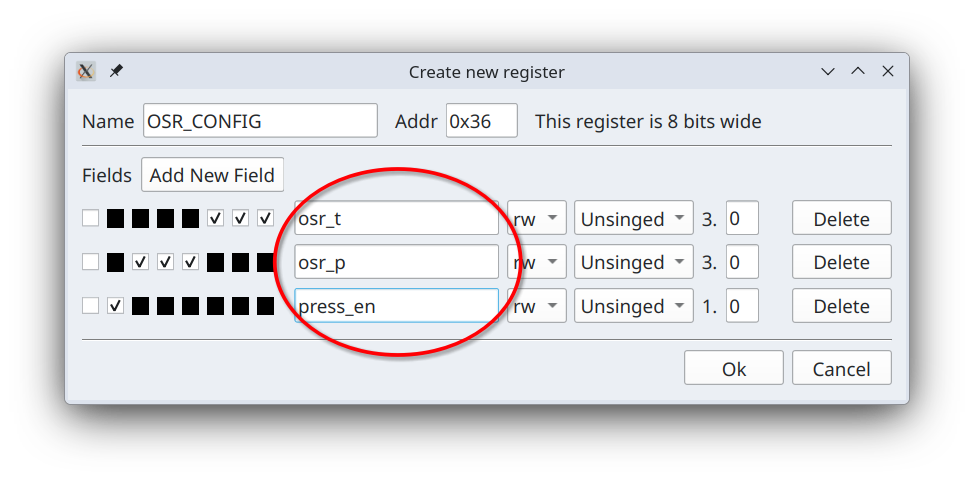
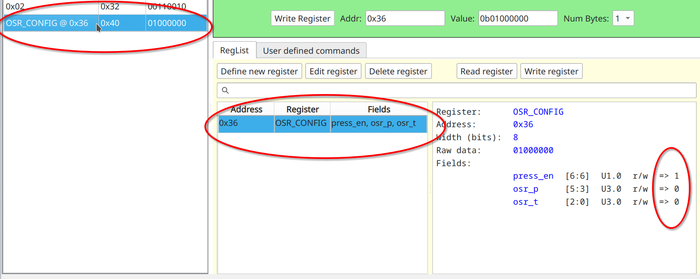
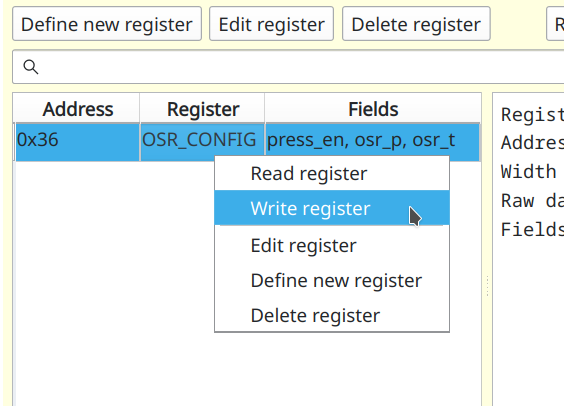
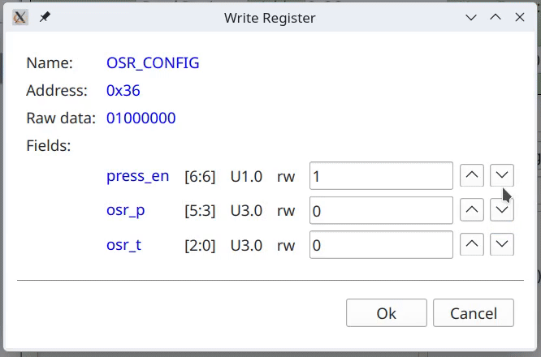
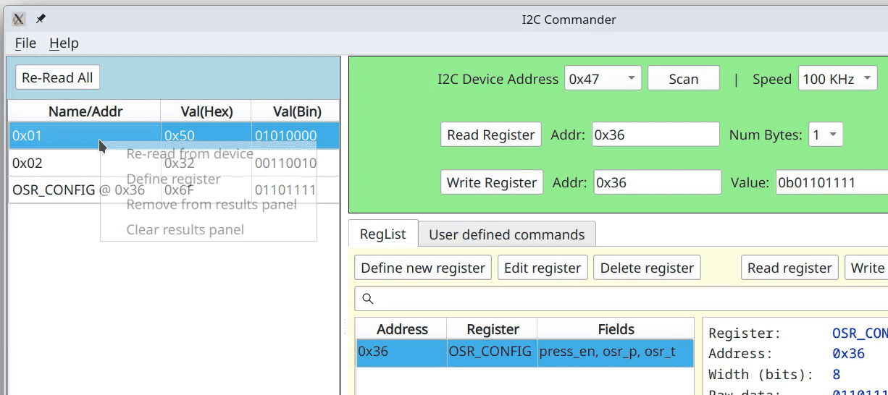

# Accessing devices using high level register models

Sending low level register read and write commands on I2C bus is useful, but registers always have clear specifications
for their fields and how to interpret them. Here is a definition for OSR register for BMP581 chip

Let's define this register in I2CC to enable much higher level access to this chip.

But first, since we are dealing with BPM581 chip lets create project specific to this chip. We do that by going to menu
"_File_" => "_Save Project As_".

This will copy currently opened project under a new name and open it. This will be reflected in the project label in the
lower left corner.

There are two ways to define a register. We will do first when we need to more informaton upfront. In the _RegList_ tab
click on "_Define new register_" button.

You will then be prompted to provide how wide is this register going to be, i.e. how many bits it will hold. The choices
are 8, 16, 24 and 32. For our chip app registers are 8 bit wide. So we simply click "_Ok_". This will bring us to the
next window "_Create new register_"

We enter register name `OSR_CONFIG` and address `0x36` and click a couple of times on
"_Add New Field_" button. This gives us three, so far empty, fields. Now by clicking checkboxes on the left we pick bits
assigned to each field and gieve each field a name as per manufacturer provoded documentation.

All feilds are read/write and have numeric types `U3.0`, `U3.0` and `U1.0`, i.e. they are all unsigned fixed point
numbers with no fractional parts. Let's click "_Ok_" and now in _RegList_ table you will see one entry for our newly 
defined register.

In the _Results_ panel on the left entry for this register has both name and an address.
On the right of _RegList_ table there is a user readable definition for this register as well 
values stored in the raw data. The reason these values are show is that this register is present 
in the left most _Results_ table. We can re-read this register by double-clicking on _RegList_ row for it or 
selecting it and clicking on "_Read Register_" button. By right mouse-clicking we can access its context menu.

Option "_Read Register_" is first and default action for double-clicking. "_Delete register_" prompts you to confirm that you 
want to delete this register and then deletes it. Selecting "_Write register_" brings up another dialog where you 
can enter values for each individual fields.

Since all fixed point types are discrete you can cycle through them by using up and down arrow buttons to the right 
of each field. Alternatively when you are editing each field you can simply use up and down arrow keys on the keyboard 
to the same effect.

Selecting "_Edit register_" from context menu will allow you to modify this register model.

You can also create register from data already present in the register results table. 

You can see that register width and address are automatically filled in.

## Links

* [Fixed-point arithmetic](https://en.wikipedia.org/wiki/Fixed-point_arithmetic) - definition of fixed point numbers.